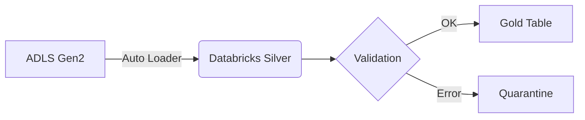

# [4.15] Draw.io / Mermaid による「パッと見で伝わる」図解の色彩・構図術

アーキテクトにとって「絵心」は不要ですが、「構成力」は必須です。

### 1. 図解のルール
*   **通信の向き**: 左（ソース）から右（ターゲット）へ。これが人間の自然な視線の動きです。
*   **アイコンの一貫性**: Azureリソース、Databricksリソースの公式アイコン集（Toolkit）を必ず使い、独自の自作アイコンは避けます。

### 2. 色彩の心理学
*   **青**: 信頼（Azure / 基盤）。
*   **赤・オレンジ**: 注意（重要な計算、Databricks / セキュリティ）。
*   **グレー**: 背景、重要度の低い補助的なパス。

### 3. テキストベースの図解 (Mermaid)
Markdown内に直接「コード」として図を書けるツールです。

---
**💡 アーキテクトのアドバイス:**
図の中に「文字（詳細説明）」を詰め込みすぎないでください。図の役割は「構造を直感的に伝えること」です。詳細は図の下に箇条書きで添えるのが、最も美しいドキュメントになります。
